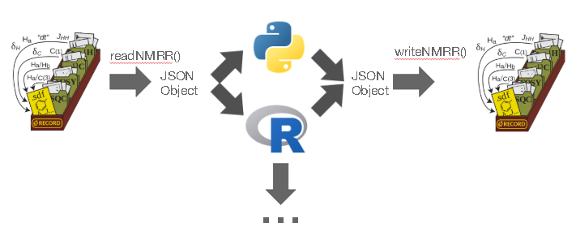

# nmredata parser

<p align="center">
  A tool for reading and generate nmrRecord.
</p>
<p align="center">
  
</p>

This package is based on the format published of [NMReData initiative](https://www.ncbi.nlm.nih.gov/pmc/articles/PMC6226248/).
For further information about the format you can also check [nmredata.org](www.nmredata.org)

## Installation

`$ npm install nmredata`

For tests, also install

`$npm i nmredata-data-test`

## Usage

```js
import { nmredata } from 'nmredata-data-test';
import { readNmrRecord, NmrRecord } from 'nmredata';

readNmrRecord(nmredata['menthol_1D_1H_assigned_J.zip'], {
  zipOptions: { base64: true },
}).then(async (nmrRecord) => {
  /**
   *  nmrRecord has all sdf files and source of spectra data inside of the instance nmrRecord.
   */
  let nbSDFFiles = nmrRecord.nbSamples;
  let sdfList = nmrRecord.getSDFList(); // it's return ["wild_JCH_coupling","only_one_HH_coupling_in_Jtag","compound1.nmredata","compound1_with_jcamp.nmredata","with_char_10","compound1_special_labels.nmredata copy"]
  /**
   * if several sdf file exists
   *  the first readed is set as activeElement, it means that you don't need
   *  to pass a filename for each operation on the same SDF file.
   *  It's possible to get or set (filename or index) an activeElement.
   */
  let activeElement = nmrRecord.getActiveElement(); //should return 'wild_JCH_coupling'
  nmrRecord.setActiveElement('only_one_HH_coupling_in_Jtag');

  /**
   * You can get the text of all tags of a specific sdf file (filename or index) with
   * getNMReDataTags, it returns an object where each tag is a property
   * with their value in text
   **/
  let allTags = nmrRecord.getNMReDataTags(); //return the tags of 'only_one_HH_coupling_in_Jtag'
  // you can get a specific tag
  let solvent = allTags['SOLVENT'];
  // To get one list with the current's tags
  let tagsList = Object.keys(allTags);
  /**
   *  It's possible to get nmredata of a specific sdf file (filename or index)
   *  as an object where each tag is a property containing an object with
   *  properties 'headComment' and 'data', the content of 'data' depend of tag's nature
   *  (e.g. the ASSIGNMENT tag has an array of objects with properties 'comment' and 'value')
   **/
  let nmredata = nmrRecord.getNMReData();
  //console.log(nmredata)

  /**
   * you can format the content of a sdf file (nmredata) and the source of spectra data (zip, jcamp) in a JSON.
   */
  var json = await nmrRecord.toJSON();
  /**
   * console.log(json)
   * {
   *   molecules: [{ molfile }],
   *   spectra: [
   *     {
   *       //1d spectrum
   *       source: {
   *         zip,
   *         jcamp,
   *       },
   *       signals: [
   *         {
   *           delta,
   *           diaID,
   *           multiplicity,
   *         },
   *       ],
   *     },
   *     {
   *       //2d spectrum
   *       source,
   *       signals: [
   *         {
   *           x: {
   *             delta,
   *             diaID,
   *           },
   *           y: {
   *             delta,
   *             diaID,
   *           },
   *         },
   *       ],
   *     },
   *   ],
   * };
   **/
});
```

## License

[MIT](./LICENSE)
